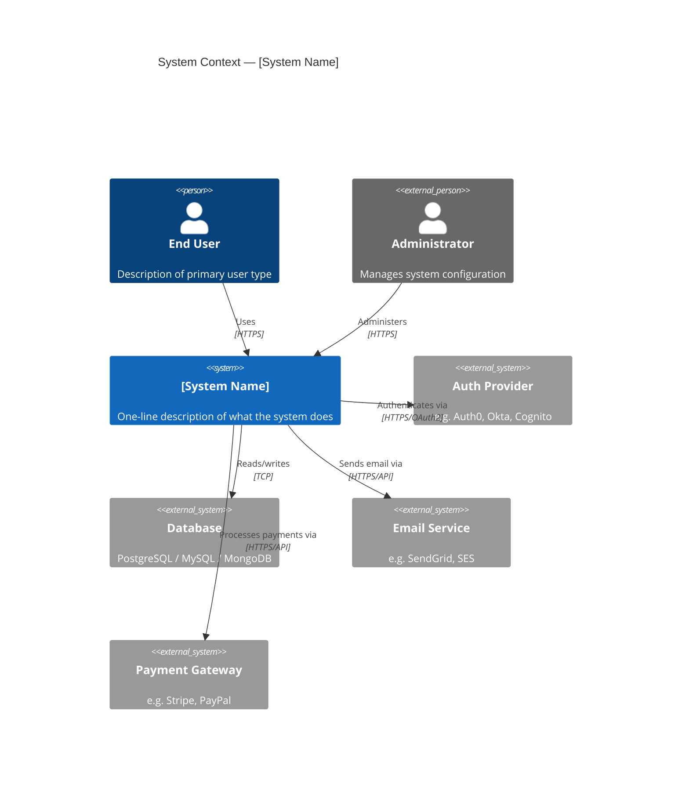
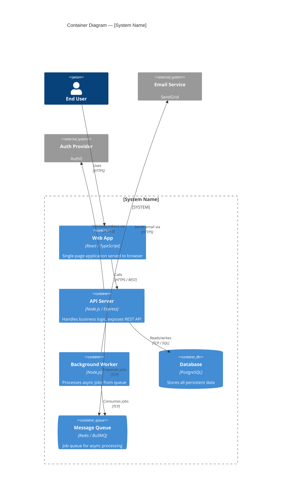
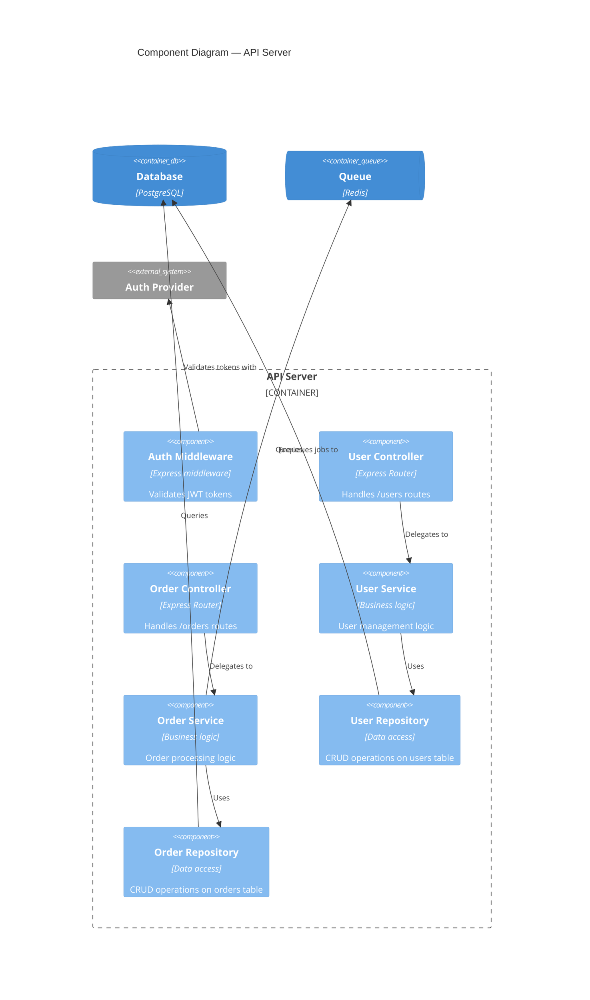
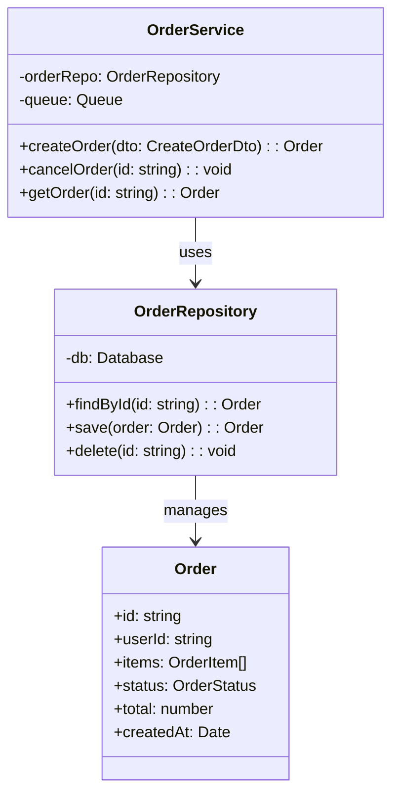

# C4 Analysis Skill

## Purpose

Produce a **C4 model** of an existing codebase — a set of hierarchical architectural diagrams
(Context → Container → Component → optional Code-level) rendered as Mermaid.js, plus a
supporting Markdown narrative. The output is a living architectural document the user can
refine and use as input for DDD analysis and refactoring planning.

The C4 model uses four levels of zoom, each targeting a different audience:
- **Level 1 – System Context**: The system and its external users/dependencies (audience: everyone)
- **Level 2 – Container**: Deployable units inside the system (audience: technical team)
- **Level 3 – Component**: Major structural units inside each container (audience: developers)
- **Level 4 – Code**: Classes/functions inside a component (audience: developers; usually optional)

---

## Phase 0 — Understand the Codebase

Before drawing anything, inventory what you're working with.

### What to collect

1. **Entry points**: `main`, `index`, `app`, startup scripts, CLI entrypoints
2. **Project structure**: top-level directories, key config files (`docker-compose.yml`,
   `Dockerfile`, `package.json`, `pom.xml`, `*.csproj`, `pyproject.toml`, `Cargo.toml`, etc.)
3. **External actors**: who/what calls this system? (end users, other services, batch jobs, IoT devices)
4. **External systems**: what does this system call? (databases, message queues, external APIs,
   third-party services, auth providers, file storage, email services)
5. **Containers**: separate deployable/runnable units — web apps, APIs, background workers,
   databases, message brokers, mobile apps, static sites
6. **Technology stack**: languages, frameworks, ORMs, messaging libraries
7. **Communication patterns**: REST, GraphQL, gRPC, events/queues, WebSockets, direct DB access

### Bash inventory commands (adapt paths as needed)

```bash
# Directory structure
find . -maxdepth 3 -type f -name "*.json" -o -name "*.toml" -o -name "*.yml" \
  | grep -E "(package|cargo|compose|docker|pom|build)" | head -30

# Docker / deployment clues
find . -name "Dockerfile*" -o -name "docker-compose*" | head -20

# External HTTP calls
grep -rn "http\|fetch\|axios\|requests\.\|HttpClient\|RestTemplate" \
  --include="*.ts" --include="*.js" --include="*.py" --include="*.java" \
  --include="*.cs" --include="*.go" -l | head -20

# Database access patterns
grep -rn "mongoose\|sequelize\|prisma\|typeorm\|sqlalchemy\|hibernate\|entity\|DbContext\|knex" \
  --include="*.ts" --include="*.js" --include="*.py" --include="*.java" --include="*.cs" \
  -l | head -20

# Message queue / event bus usage
grep -rn "rabbitmq\|kafka\|redis\|pubsub\|eventbus\|emit\|subscribe\|publish" \
  --include="*.ts" --include="*.js" --include="*.py" --include="*.java" \
  -l | head -20

# API routes (common patterns)
grep -rn "router\.\|app\.get\|app\.post\|@Get\|@Post\|@Controller\|Route\[" \
  --include="*.ts" --include="*.js" --include="*.py" --include="*.java" \
  --include="*.cs" -l | head -20
```

---

## Phase 1 — Build the C4 Diagrams

Produce diagrams from outermost to innermost. Stop at Component level unless the user
explicitly asks for Code-level (Level 4), or the codebase is small enough that it adds value.

### Level 1 — System Context Diagram

Identify:
- The **system under study** (one box, center)
- **Users/Personas** that interact with it (people shapes)
- **External systems** it depends on or integrates with



### Level 2 — Container Diagram

For each **system** in scope, identify its containers (separately deployable/runnable units):

| Container type | Examples |
|---|---|
| Web Application | React SPA, Angular app, server-rendered HTML |
| API Application | REST API, GraphQL server, gRPC service |
| Background Worker | Job processor, message consumer, cron |
| Database | Relational DB, document store, cache |
| Message Broker | Kafka, RabbitMQ, Redis Streams |
| Mobile App | iOS, Android |
| File Storage | S3, blob storage |



### Level 3 — Component Diagram (per container)

For each significant container, identify its major internal components (controllers, services,
repositories, domain modules, handlers, middleware, etc.).



### Level 4 — Code Diagram (optional, per component)

Only produce this level if the user asks or if a component is complex enough to warrant it.
Use a class diagram or sequence diagram as appropriate.



---

## Phase 2 — Architectural Observations

After producing the diagrams, write a brief narrative covering:

### What to note

1. **Architectural style**: monolith, modular monolith, microservices, serverless, event-driven, layered
2. **Layer clarity**: is there clear separation of concerns (controllers → services → repositories)?
3. **Boundary violations**: does the presentation layer reach into data access? Do services cross-call?
4. **External coupling**: how many external systems does this depend on, and how tightly?
5. **Data ownership**: does each container/component own its data, or is there shared database access?
6. **Async patterns**: are there queues, events, or background workers, and are they used appropriately?
7. **Scaling concerns**: what are the obvious bottlenecks or single points of failure?
8. **Missing abstractions**: are there repeated patterns that lack a shared abstraction?

### Validate boundaries against change history (data-driven check)

The diagrams above show the *intended* architecture. Version-control history tells you whether the boundaries are **real**. Containers or components that the diagram separates but that *consistently change together* in the same commits are coupled in practice — the boundary is fictional, and you've likely found a distributed monolith or architectural decay. (Technique from Adam Tornhill, *Your Code as a Crime Scene* — change-coupling and "Catch Architectural Decay.")

```bash
# Files/dirs that change together across commits — run on the component or container roots.
# Pairs that co-change in a high fraction of commits, but sit on opposite sides of a
# boundary you drew, are the evidence of architectural decay.
git log --format="COMMIT" --name-only --since="12 months ago" \
  | awk '/COMMIT/{print "---"} !/COMMIT/{print}'
```

When the data contradicts the diagram, **say so in the observations** — e.g., "The API and Worker are drawn as independent containers, but they change together in ~70% of commits, indicating a shared hidden dependency (likely the shared schema). Treat them as one deployment unit until decoupled." This is one of the most valuable outputs of the analysis: it distinguishes the architecture-on-paper from the architecture-in-practice.

### Red flags to call out explicitly

- God classes / god services (a single service doing everything)
- Direct database access from controllers or presentation layer
- Circular dependencies between components
- Shared mutable state across containers
- No clear API boundary between logical modules
- Business logic scattered across multiple layers
- Hardcoded external service URLs / configs
- **Boundaries the change history contradicts** — separately-drawn containers/components that consistently co-change (a "distributed monolith"); see the change-history validation above

---

## Output Format

Produce a single Markdown file structured as:

```
# C4 Architecture Analysis: [Project Name]

> **Analyzed:** [date]
> **Codebase root:** [path or repo]
> **Primary language/stack:** ...
> **Architectural style detected:** ...

---

## Level 1 – System Context

[narrative: who uses this and what external systems does it interact with?]

```mermaid
[context diagram]
```

---

## Level 2 – Containers

[narrative: what are the deployable units and how do they communicate?]

```mermaid
[container diagram]
```

---

## Level 3 – Components

### [Container Name 1]

[narrative]

```mermaid
[component diagram]
```

### [Container Name 2]  ← repeat for each significant container

---

## Level 4 – Code (Optional)

[only if requested or warranted]

---

## Architectural Observations

### Detected Style
...

### Strengths
- ...

### Concerns & Smells
- ...

### Open Questions
Things that were unclear from static analysis alone that the user should verify:
- ...
```

---

## Output Delivery

1. Write the file to `[project-slug]-c4-analysis.md` in the folder where the skill was invoked
2. Confirm the file path to the user
3. Add a 2–3 sentence inline summary: the architectural style detected, the most important
   structural concern, and the recommended next step (DDD analysis or refactoring plan)

---

## Quality Checklist

Before writing output:

- [ ] All four external actor/system types identified (users, admin roles, external services, data stores)
- [ ] All containers are separately deployable units — not just logical modules
- [ ] Component diagram produced for at least the most complex container
- [ ] Technology labels included on every container and component
- [ ] All relationships have direction AND a label describing the interaction
- [ ] Architectural observations section has at least 3 concrete observations
- [ ] Drawn boundaries checked against change history where VCS is available (co-changing containers/components flagged), or noted as not performed
- [ ] Open questions listed for anything that was inferred rather than confirmed
- [ ] Mermaid syntax validated — use C4Context/C4Container/C4Component (not plain flowchart) for C4 levels
