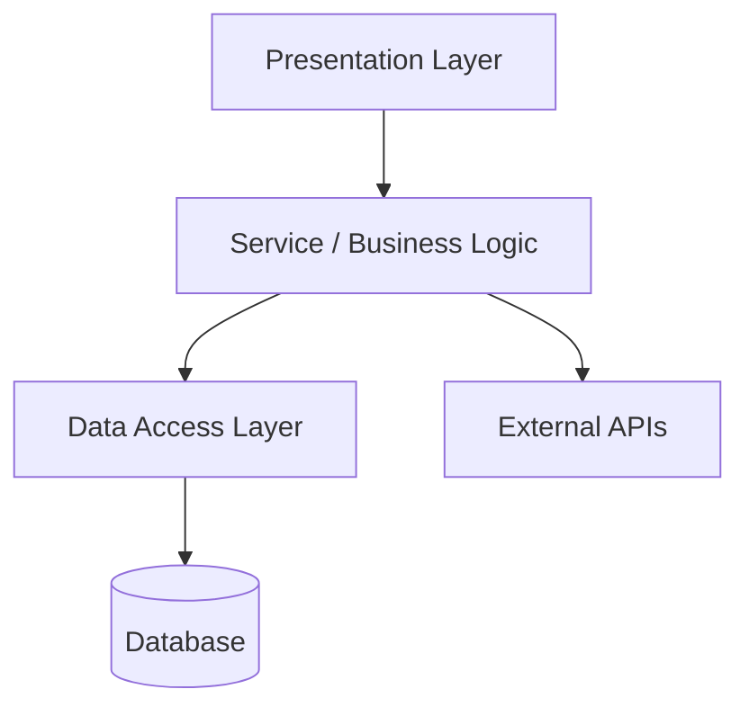

# Codebase Orientation Skill

Explores an unfamiliar or legacy codebase and produces a structured Markdown orientation report — a durable reference the developer can keep and build on. The report is adaptive: it always starts with a rapid overview, then offers to drill into any section in depth.

---

## Orientation Philosophy

Legacy codebases rarely announce themselves. The goal is to answer the questions a new developer would ask on day one:

- *How does this thing start?*
- *What does it actually do?*
- *Where does the important logic live?*
- *What does it talk to?*
- *What should I be careful about?*

Prioritize **orientation over judgment**. This is not a code review. Flag risks lightly and directionally — enough to know where to tread carefully — but do not produce formal findings. The code-review skill exists for that.

---

## Adaptive Depth Model

This skill always operates in two phases:

### Phase 1 — Rapid Overview (always run first)
Produce the full report structure with all sections filled in at summary depth. The goal is a complete, useful map of the codebase in the shortest reasonable time. Aim for breadth: touch everything, go deep on nothing yet.

### Phase 2 — Drill-Down (offered after Phase 1)
After presenting the Phase 1 report, always close with:

> **Want to go deeper?** I can expand any of these sections:
> - [ ] Entry points & startup sequence
> - [ ] Architecture narrative
> - [ ] Key components — [list the top 3–5 by name]
> - [ ] Data models
> - [ ] Configuration & environment
> - [ ] Workflows — [list workflows identified]
> - [ ] External dependencies
> - [ ] Risk areas

The user selects one or more and you produce a focused deep-dive, appending it to the saved report under a `## Deep Dive` heading.

---

## Exploration Process

### Step 1: Establish Scope
Read the user's request:
- Entire repository, a specific module/package, or a particular area?
- If unclear, state your assumption in the report and proceed.

### Step 2: Orient Before Reading Code
Before opening source files, build a map:

```bash
# Understand project shape
find . -maxdepth 3 -type f | sort        # Overall file tree
cat README* 2>/dev/null                   # Any existing docs
ls -la                                    # Root-level artifacts
```

Look for and read:
- **Dependency manifests**: `pom.xml`, `build.gradle`, `package.json`, `requirements.txt`, `go.mod`, `Gemfile`, `*.csproj`
- **Build/run scripts**: `Makefile`, `Dockerfile`, `docker-compose.yml`, `*.sh`, `Procfile`, `*.bat`
- **Config files**: `application.properties`, `application.yml`, `*.env*`, `config/`, `settings.py`, `web.xml`
- **CI/CD**: `.github/workflows/`, `Jenkinsfile`, `.gitlab-ci.yml`
- **Existing docs**: `docs/`, `wiki/`, `ARCHITECTURE*`, `CONTRIBUTING*`

### Step 2.5: Read the Evolution — Mine the Version History
Before deep-reading source, let the codebase's *history* tell you where to look. Static structure shows what exists; the commit log shows what actually moves, breaks, and matters. This reframes every step that follows — orient toward the code that churns, not the code that merely exists. (Technique adapted from Adam Tornhill, *Your Code as a Crime Scene*, 2e.)

```bash
# Most-churned files (change frequency = a proxy for where the work and the risk concentrate)
git log --format=format: --name-only --since="12 months ago" \
  | grep -v '^$' | sort | uniq -c | sort -rn | head -30

# Recency — what's been touched lately vs. what's gone cold
git log -1 --format="%ai" -- <path>            # last touch of a file/area

# Author concentration / knowledge map — who owns each hot file (and bus-factor risk)
git shortlog -sn --since="12 months ago" -- <path>
```

What to extract:
- **Hotspots** — files that are *both* high-churn and large/complex. These are the highest-value things to understand first: change concentrates there, so a new developer will end up there fast. Cross-reference the churn list above against file size (`wc -l`) or any available complexity metric.
- **Change coupling** — files that repeatedly appear in the same commits reveal hidden dependencies static analysis misses. Skim recent merge/feature commits for files that always move together.
- **Knowledge map & truck factor** — when one author owns nearly all commits to a hot area, that's both *who to ask* and an offboarding risk worth flagging in Step 10.
- **Trend, not just snapshot** — a file getting steadily larger/more-churned over time is decaying; one that's stabilized is safer. Direction matters more than absolute size.

> If the repo isn't a git/hg/svn checkout, or history is shallow/squashed, note that and fall back to static signals. Don't fabricate evolution data.

### Step 3: Find Entry Points
Identify how the application starts and where control flows from there. Strategies by type:

| App Type      | Entry Point Signals                                                              |
|:--------------|:---------------------------------------------------------------------------------|
| Java / Spring | `@SpringBootApplication`, `public static void main`, `web.xml`, servlet mappings |
| Java EE / JSP | `web.xml` servlet/filter config, JSP files in `webapp/`, tag libraries           |
| Node.js       | `main` in `package.json`, `index.js`, `server.js`, `app.js`                      |
| Python        | `if __name__ == "__main__"`, `manage.py`, `app.py`, `wsgi.py`, `asgi.py`         |
| Go            | `package main` + `func main()`                                                   |
| Ruby / Rails  | `config.ru`, `application.rb`, `routes.rb`                                       |
| .NET          | `Program.cs`, `Startup.cs`, `Global.asax`                                        |

Trace the startup sequence: what gets initialized, in what order, before the app is ready to serve.

### Step 4: Map the Architecture
Identify layers and how they relate — without producing a C4 diagram (that's the c4-analysis skill). Instead, describe the architecture in plain language and a simple Mermaid layer sketch:



Keep it high-level. The goal is orientation, not precision. Note the architectural style (MVC, layered, hexagonal, event-driven, monolith, modular monolith, microservice, etc.) and whether the code actually follows it.

> **Note**: For a full, rigorous C4 model with Context, Container, and Component diagrams, use the **c4-analysis** skill.

### Step 5: Identify Key Components
Find the 5–15 most important classes, modules, services, or files — the ones a developer must understand to work effectively in this codebase. For each, capture:
- What it does (one sentence)
- Why it matters (central to a flow? shared utility? God class?)
- Where it lives (file path)

Signals of importance:
- Referenced everywhere (high import/dependency count)
- Contains core business logic
- Named after a core domain concept
- Entry point or router
- Manages shared state, caches, or sessions
- Unusually large or complex
- **High change frequency** — appears near the top of the Step 2.5 churn list. A file that's both large/complex *and* frequently changed is a **hotspot**: prioritize it, because that's where development effort and risk concentrate (Tornhill). Pair this evidence with the static signals above rather than relying on intuition alone.

### Step 6: Data Models & Persistence
Identify how data is structured and stored:
- ORM entities / model classes (JPA `@Entity`, Django models, ActiveRecord, Hibernate mappings, EF entities)
- Database schema files (`.sql`, migrations, Flyway/Liquibase changesets)
- Key relationships (one-to-many, joins, foreign keys worth knowing about)
- Persistence technology (RDBMS, NoSQL, in-memory, file-based) and connection configuration
- Any caching layer (Redis, Memcached, Ehcache, in-process)

For Phase 1, list entity names and a one-line purpose. Full field-by-field breakdown belongs in Phase 2.

### Step 7: Configuration & Environment
Map what can be configured and how:
- Config files and their format/location
- Environment variables the app reads (look for `System.getenv`, `os.environ`, `process.env`, `.env` files)
- Profiles or modes (dev / staging / prod) and how they differ
- Secrets handling — where credentials are expected to come from
- Feature flags or toggles, if present

### Step 8: Workflows & User-Facing Flows
Identify the major things the application does from a user or business perspective — not code paths, but outcomes:
- For web apps: key routes/endpoints and what they accomplish
- For batch/CLI: the main jobs or commands
- For services/APIs: the primary operations exposed
- For event-driven systems: the key event types and what triggers them

Trace 2–3 of the most important flows from entry point to response/output at a high level.

### Step 9: External Dependencies & Integrations
Catalog what the application depends on outside itself:
- **Databases** (type, name if visible)
- **External APIs / services** (look for HTTP clients, SDK imports, base URLs in config)
- **Message brokers** (Kafka, RabbitMQ, SQS, JMS)
- **Authentication providers** (LDAP, OAuth, SAML, internal auth service)
- **File systems / object storage** (S3, NFS, local paths)
- **Scheduled jobs / cron** (Quartz, cron expressions, `@Scheduled`)
- **Third-party libraries** of note (not exhaustive — flag unusual or heavyweight ones)

### Step 10: Risk & Caution Areas
Light directional callouts only — not formal findings. Flag areas the developer should be aware of before making changes:
- **Hotspots** — files surfaced in Step 2.5 that are both complex and high-churn. The single most useful caution you can give: "this file is a hotspot — complex and changed N times this year — understand it before touching it."
- **Truck-factor risk** — hot areas owned almost entirely by one author (from the Step 2.5 knowledge map). Flag both the risk *and* who to consult.
- Patterns that suggest fragility (global mutable state, God classes, deep coupling)
- Obvious absence of tests in critical areas
- Configuration that looks environment-specific and easy to misconfigure
- Areas where the code diverges significantly from its apparent architectural intent
- Anything that looks like it hasn't been touched in a long time but is still load-bearing

Format as brief bullets under a "⚠️ Watch Out" subheading. Prefer evidence (churn counts, author concentration) over adjectives — "changed 40 times in 6 months by one author, no tests" beats "fragile." Do not assign severity or provide remediation — that's the code-review skill's job.

---

## Deeper Comprehension Techniques

When static reading stalls — the code is too tangled, has no apparent structure, or you genuinely can't tell what it *does* — escalate to these active techniques rather than guessing. They are comprehension aids, not refactors; orientation still comes before judgment. (Techniques from Michael Feathers, *Working Effectively With Legacy Code*, Ch. 11, 13, 16–17.)

- **Effect sketching** — pick a value or method and sketch outward to everything its result can affect (and what affects it). A quick pen-and-paper or bullet-list ripple map clarifies the flows traced in Step 8 far faster than reading every caller.
- **Scratch refactoring** — refactor freely *to understand*, not to keep: extract methods, rename, collapse conditionals until the intent is legible. Then **throw it away** (`git stash` / `git checkout .`). The understanding is the deliverable; the diff is disposable.
- **Listing markup / notes** — copy a confusing routine and mark it up: bracket responsibilities, circle shared state, label blocks. Externalizes structure your working memory can't hold.
- **Tell the story of the system** (for codebases with *no* apparent structure) — narrate, in writing, what the system does in domain terms at the highest level, then one level down, and let the real responsibilities emerge from the gap between the story and the code. Pairs with the architecture work in Step 4.
- **Characterization tests** — when you cannot tell what a piece of code does, write a test that captures its *current* behavior (assert whatever it actually returns, then make the test pass). Pins down behavior as an orientation aid — but stay within orientation scope; full test-harnessing is the refactoring job, not this skill's.

Reach for these selectively and note in the report when you used one (e.g., "behavior of `PriceCalculator` confirmed via a scratch characterization test"). Don't commit scratch changes or characterization tests unless the user asks.

---

## Report Structure

Save the report as `orientation-YYYYMMDD.md`.

- Default location: the project root, or a `docs/` folder if the project already keeps documentation there.
- If the user's environment maintains a separate documentation/wiki location for this project, save it there instead — ask the user if unsure.
- The canonical filename is always `orientation-YYYYMMDD.md` — no `analysis-`, `guide-`, or `codebase-` prefix.

Get today's date:

```powershell
Get-Date -Format "yyyyMMdd"
```

```
# Codebase Orientation: <project name>
*Generated: YYYY-MM-DD | Scope: <what was reviewed>*

---

## TL;DR
<3–5 sentence plain-English summary. What is this system? What does it do? What stack is it on? What's the most important thing to know before touching it?>

---

## Entry Points & Startup Sequence
<How the app starts. What's the main entry point, what gets initialized, and in what order.>

---

## Architecture Overview
<Architectural style, layers, and how they relate. Plain language + Mermaid sketch.>

> For a full C4 model, run the **c4-analysis** skill.

---

## Evolution & Hotspots
<What the version history reveals — the files where change and risk concentrate. Omit this section if no usable VCS history is available, and say so.>

| File / Area | Changes (12mo) | Size/Complexity | Primary Author(s) | Note |
|:------------|:---------------|:----------------|:------------------|:-----|
| `path/to/hotspot` | 42 | ~1,800 LOC | one author | Hotspot — understand before changing |
| ...         |                |                 |                   |      |

<Call out notable change coupling (files that move together) and any truck-factor risk.>

---

## Key Components

| Component   | Purpose              | Location       |
|:------------|:---------------------|:---------------|
| `ClassName` | One-line description | `path/to/file` |
| ...         |                      |                |

<Brief narrative on the most important components and how they relate.>

---

## Data Models & Persistence
<Persistence technology, key entities/models and their purpose, notable relationships, caching.>

| Entity / Model | Purpose |
|:---------------|:--------|
| `EntityName`   | ...     |

---

## Configuration & Environment
<Config files, key environment variables, profiles/modes, secrets handling.>

| Setting  | Where             | Purpose                     |
|:---------|:------------------|:----------------------------|
| `DB_URL` | `application.yml` | Primary database connection |
| ...      |                   |                             |

---

## Workflows & User-Facing Flows
<The major things this system does, from a business/user perspective. Key routes, jobs, or operations. 2–3 traced flows.>

---

## External Dependencies & Integrations

| Dependency | Type         | Notes              |
|:-----------|:-------------|:-------------------|
| PostgreSQL | Database     | Primary store      |
| Stripe API | External API | Payment processing |
| ...        |              |                    |

---

## ⚠️ Risk & Caution Areas
- <Directional callout — what to be careful about, not a formal finding>
- ...

---

## Next Steps
- Run **c4-analysis** for a full architectural diagram
- Run **code-review** on [highest-risk area identified] for formal findings
- Ask me to drill deeper into any section above

---

*Phase 1 complete. Reply with any section name to go deeper.*
```

---

## Tone and Calibration

- Write for a developer who is smart but knows nothing about this specific codebase.
- Prefer plain English over jargon. Name things as they are named in the code.
- Be honest about gaps: if something wasn't findable, say so rather than guessing.
- Directional risk callouts should be useful, not alarming. "This class is 2,000 lines and touches everything — understand it before changing it" is more useful than "God class detected."
- If the codebase is genuinely well-structured and documented, say so. Don't manufacture caveats.
- If the codebase is a mess, be clear about that too — the developer needs an honest map, not a flattering one.
