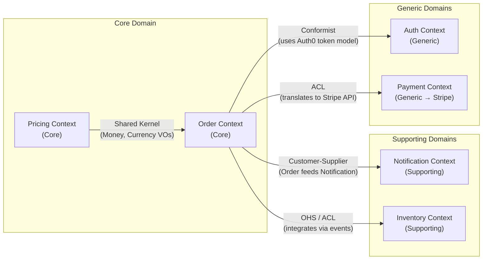

# DDD Analysis Skill

## Purpose

Produce a **Domain-Driven Design analysis** of an existing codebase — mapping business
concepts to DDD elements, identifying bounded contexts, detecting domain model health, and
producing a Mermaid.js context map. The output feeds directly into the refactoring-plan skill.

DDD operates at two levels:
- **Strategic Design** — the big picture: subdomains, bounded contexts, integration patterns, context map
- **Tactical Design** — the implementation detail: aggregates, entities, value objects, domain events, repositories, services

---

## Phase 0 — Gather Domain Evidence

Before classifying anything, collect evidence of business concepts from the code.

### What to look for

1. **Nouns** (potential entities/value objects): class names, table names, variable names, API resource names
2. **Verbs / behaviors** (potential domain events / commands): method names, event names, queue message types, API endpoint names
3. **Groupings** (potential bounded contexts): top-level packages/modules/namespaces, microservice names, database schema names
4. **Invariants** (potential aggregate roots): validation logic, transactional boundaries, "you can't do X without Y" rules
5. **Rules / policies**: conditional business logic, eligibility checks, pricing rules, state machine transitions

### Bash evidence-gathering commands

```bash
# Find top-level module/package groupings
ls -la src/ app/ lib/ packages/ services/ modules/ 2>/dev/null | head -40

# Entity/model class names (common patterns)
grep -rn "class\|interface\|struct\|type " \
  --include="*.ts" --include="*.py" --include="*.java" --include="*.cs" \
  --include="*.go" | grep -v "//\|#\|test\|spec\|mock" \
  | grep -E "(Entity|Model|Domain|Aggregate|Record)" | head -40

# Domain event names
grep -rn "Event\|event\|Emitted\|Published\|Raised" \
  --include="*.ts" --include="*.py" --include="*.java" --include="*.cs" \
  | grep -E "class|const|type|interface" | head -30

# Repository / data access patterns
grep -rn "Repository\|Repo\|DAO\|Store\|Persistence" \
  --include="*.ts" --include="*.py" --include="*.java" --include="*.cs" \
  | grep "class\|interface" | head -20

# Service layer patterns
grep -rn "Service\|UseCase\|Handler\|Command\|Query" \
  --include="*.ts" --include="*.py" --include="*.java" --include="*.cs" \
  | grep "class\|interface" | head -20

# Database tables / schema
find . -name "*.sql" -o -name "*migration*" -o -name "*schema*" \
  | head -10 | xargs grep -l "CREATE TABLE\|model\.\|collection\." 2>/dev/null | head -10
```

---

## Phase 1 — Strategic Design Analysis

### Step 1.1 — Identify Subdomains

Classify every major functional area into one of three subdomain types:

| Type | Definition | Signs in code |
|---|---|---|
| **Core** | The primary competitive advantage — what makes this business unique | Most complex logic, most churn, highest test coverage, domain experts most engaged |
| **Supporting** | Necessary but not differentiating — enables the core | Simpler logic, often internal tooling, CRUD-heavy |
| **Generic** | Solved problems — commodity functionality | Thin wrappers, delegated to third-party libraries/SaaS |

**Output as a table:**

| Subdomain | Type | Evidence | Notes |
|---|---|---|---|
| Order Management | Core | Complex pricing, eligibility rules | High invariant density |
| User Authentication | Generic | Thin wrapper on Auth0 | Could be fully outsourced |
| Notification | Supporting | Simple template-based emails | Low complexity |

### Step 1.2 — Identify Bounded Contexts

A bounded context is a **linguistic boundary** — a region where a particular model and
ubiquitous language applies consistently. Signs of bounded context boundaries:
- The same word means different things in different parts of the code
- A module/service could change its internals without any other module caring
- Separate teams own separate modules
- Separate databases or schemas

For each bounded context found:
- Name it using domain language (not technical terms)
- List the concepts that live inside it
- Note its type (maps to a subdomain)
- Identify its public interface (API, events, shared kernel)

### Step 1.3 — Build the Context Map

Map the integration patterns between bounded contexts using DDD's relationship vocabulary:

| Pattern | Meaning |
|---|---|
| **Partnership** | Two teams coordinate changes together |
| **Shared Kernel** | Two contexts share a subset of the domain model |
| **Customer–Supplier** | Upstream context serves downstream; downstream adapts |
| **Conformist** | Downstream adopts upstream's model wholesale |
| **Anticorruption Layer (ACL)** | Downstream translates upstream's model to protect its own |
| **Open-Host Service (OHS)** | Upstream publishes a formal integration protocol |
| **Separate Ways** | No integration; each goes its own way |



---

## Phase 2 — Tactical Design Analysis

For each **core** bounded context (and any supporting context complex enough to warrant it),
analyze the tactical building blocks.

### Step 2.1 — Identify Aggregates and Aggregate Roots

An aggregate is a cluster of objects treated as a single unit for data consistency.
The **aggregate root** is the entry point — all access to the aggregate goes through it.

Signs of an aggregate root in code:
- Has an ID that other objects reference
- Enforces invariants across its children
- Is the only object directly persisted (children are cascaded)
- Has a repository dedicated to it

**Red flags:**
- Multiple services directly manipulating "child" objects without going through the root
- No clear owner of a consistency invariant
- Transaction boundaries spanning multiple "aggregate-like" objects

### Step 2.2 — Classify Entities vs. Value Objects

| Building Block | Identity | Mutability | Signs in code |
|---|---|---|---|
| **Entity** | Has a unique ID | Often mutable | Has `id`, `createdAt`, dedicated repo |
| **Value Object** | Defined by its value | Should be immutable | No ID, equality by attributes, e.g. `Money`, `Address`, `Email` |

Look for classes/structs that should be value objects but are modeled as entities (given IDs
and stored in their own tables when they should just be embedded). This is a common smell.

### Step 2.3 — Identify Domain Events

Domain events represent something meaningful that happened in the domain.

Signs in code: `OrderPlaced`, `PaymentProcessed`, `UserRegistered`, `InventoryReserved`

Note which events cross bounded context boundaries (integration events) vs. which are
internal to a context (domain events).

### Step 2.4 — Classify Services

| Type | Responsibility | Signs |
|---|---|---|
| **Domain Service** | Pure domain logic that doesn't fit an entity/VO | Stateless, operates on domain objects, no infrastructure deps |
| **Application Service** | Orchestrates use cases, coordinates domain objects | Thin, delegates to domain objects, handles transactions |
| **Infrastructure Service** | Technical concerns (email, file storage, notifications) | Implements domain interfaces, depends on external systems |

A major smell: **fat application services** that contain domain logic (the logic that should
live in aggregates/domain services is instead in the application layer).

---

## Phase 3 — Ubiquitous Language Glossary

Extract and document the domain language used in the codebase. Note inconsistencies.

```markdown
## Ubiquitous Language Glossary

| Term | Definition | Context | Notes / Inconsistencies |
|---|---|---|---|
| Order | A customer's request to purchase items | Order Context | Also called "Cart" in the frontend — inconsistency |
| Fulfillment | The process of picking and shipping an order | Fulfillment Context | Sometimes called "Shipment" in legacy code |
| SKU | Stock Keeping Unit — unique product identifier | Inventory Context | Consistent |
```

---

## Phase 4 — Domain Model Health Assessment

Score the domain model on these axes:

| Dimension | Green | Yellow | Red |
|---|---|---|---|
| **Aggregate boundaries** | Clear, enforced | Some leaks | No aggregates; anemic model |
| **Ubiquitous language** | Consistent throughout | Some synonyms | Different terms in code vs. business |
| **Context boundaries** | Explicit, enforced | Implicit but mostly respected | Tangled, context-free monolith |
| **Business logic location** | In domain objects | Partially in services | All in controllers or DB queries |
| **Value object usage** | Primitives wrapped in VOs | Mixed | Primitive obsession throughout |
| **Domain events** | Explicit, named events | Ad hoc callbacks | No events; direct coupling |

---

## Output Format

```
# DDD Analysis: [Project Name]

> **Analyzed:** [date]
> **Based on C4 analysis:** [yes/no — link if yes]

---

## Strategic Design

### Subdomain Map

[table of subdomains with types and evidence]

### Bounded Contexts

#### [Context Name 1]
- **Type:** Core / Supporting / Generic
- **Concepts:** [list of key concepts that live here]
- **Public interface:** [REST API / Events / Shared Kernel / none]
- **Team ownership:** [if discernible]

#### [Context Name 2] ← repeat for each

### Context Map

[narrative describing integration relationships]

```mermaid
[context map diagram]
```

---

## Tactical Design

### [Context Name] — Tactical Breakdown

#### Aggregates

| Aggregate Root | Children | Key Invariants | Notes |
|---|---|---|---|

#### Entities

| Entity | Identity | Key Behaviors | Smells |
|---|---|---|---|

#### Value Objects

| Value Object | Attributes | Currently modeled as... | Recommendation |
|---|---|---|---|

#### Domain Events

| Event | Producer | Consumers | Type (domain/integration) |
|---|---|---|---|

#### Services

| Service | Type | Responsibilities | Smells |
|---|---|---|---|

### Aggregate Diagram

```mermaid
classDiagram
  [aggregate relationship diagram]
```

---

## Ubiquitous Language Glossary

[table]

---

## Domain Model Health Assessment

[scored table]

### Key Findings

1. **[Finding title]**: ...
2. ...

### DDD Debt

- High: ...
- Medium: ...
- Low: ...
```

---

## Output Delivery

1. Write to `[project-slug]-ddd-analysis.md` in the folder where the skill was invoked
2. Confirm the file path to the user
3. Add 2–3 inline sentences: the most important strategic finding (bounded context
   boundary issue or subdomain misclassification), the most important tactical finding
   (aggregate/entity/VO issue), and a transition note pointing to the refactoring-plan skill

---

## Quality Checklist

- [ ] Every top-level module/package has been assigned to a subdomain
- [ ] Every subdomain is classified (Core / Supporting / Generic) with evidence
- [ ] At least one bounded context identified per subdomain
- [ ] Context map shows all inter-context relationships with named patterns
- [ ] Aggregate roots identified for all core contexts
- [ ] Value object candidates called out (especially primitive obsession cases)
- [ ] Domain events listed (even if they don't exist yet but should)
- [ ] Ubiquitous language glossary populated with at least the core context terms
- [ ] Domain model health assessment completed
- [ ] "DDD Debt" section distinguishes high/medium/low priority issues
